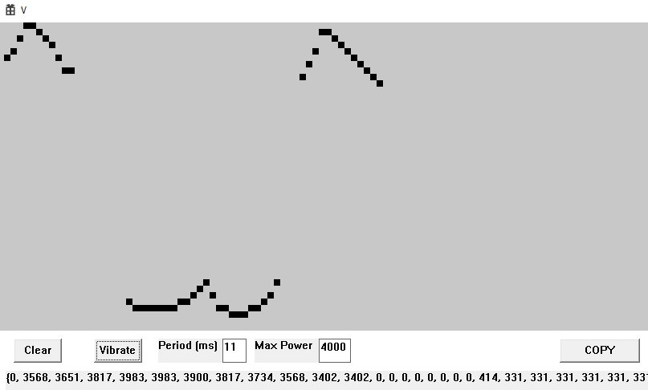

# Controller Vibration Test

## Usage

It's a background app, so if SteamVR is not running when it's launched it will exit silently.

Each pixel is a timestep of length [period]

Left click: draw 
Right click: erase

I know vibration shouldn't be tied to framerate but this gives you a preview of what it would be like if it was ;)

## Building
Requires [openvr_api.lib](https://github.com/ValveSoftware/openvr/tree/master)